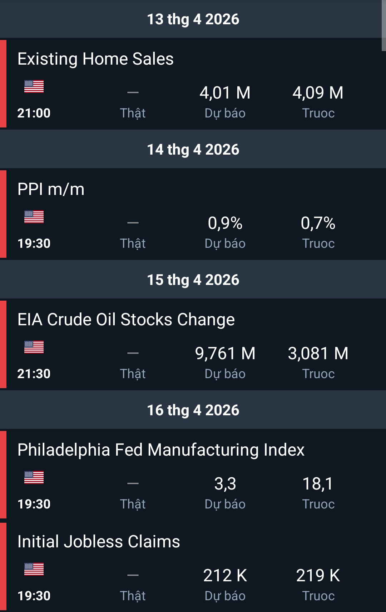

# 30

Trade Date: 14/04/2026
Trade Recap: 30/USTEC_2026-04-14_21-47-29_19e5c.png
Pair: US100
Strategy: Price Action
Setup: IFVG LTF, Sweep LTF
Macro: 4:03 - 4:30
Hợp lưu GB: No
Follow your plan: No
bias: HH/LL
Market Condition: Trending HTF, Trending LTF, Trending MTF
Entry: Market
Entry TF: 15m, 1m
R:R: 3.63
R:R Potential: 3.63
WR: Win
Position: Buy
Day: Tues
Month: April
STime Entry: NY1 20:00 – 22:15

